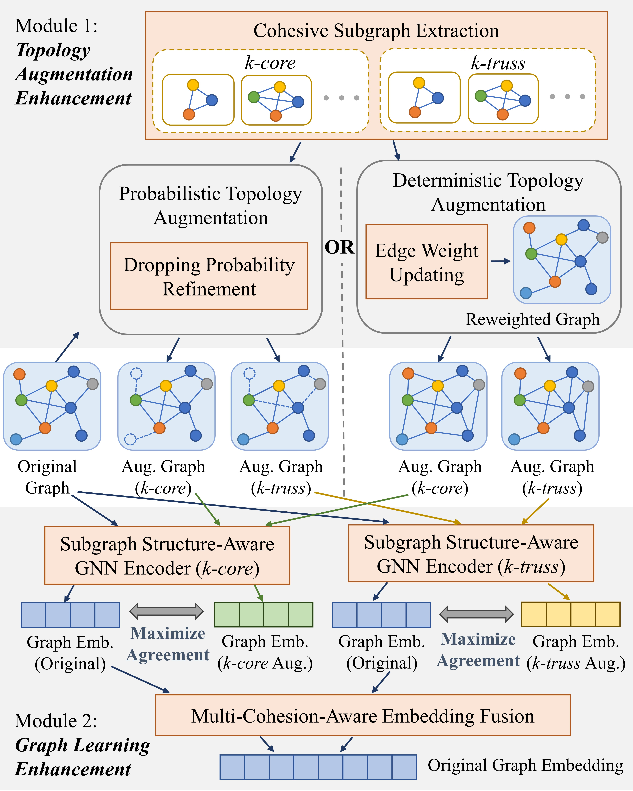

# **Graph Contrastive Learning with Cohesive Subgraph Awareness**

Our research paper has been accepted to The Web Conference 2024.

arXiv: http://arxiv.org/abs/2401.17580


## Catalog of This Code Repository

- [**Graph Contrastive Learning with Cohesive Subgraph Awareness**](#graph-contrastive-learning-with-cohesive-subgraph-awareness)
  - [CTAug Framework](#ctaug-framework)
  - [Requirements](#requirements)
  - [File Directory](#file-directory)
  - [Arguments Description](#arguments-description)
    - [get\_sub\_counts.py](#get_sub_countspy)
    - [main.py](#mainpy)
    - [Methods List](#methods-list)
  - [Parameter Setting in Our Experiments](#parameter-setting-in-our-experiments)
    - [get\_sub\_counts.py](#get_sub_countspy-1)
    - [main.py (--factor)](#mainpy---factor)
  - [Running Examples](#running-examples)


## CTAug Framework

<div align=center>

</div>


## Requirements

- python  3.8
- torch  1.12.0
- torch-geometric  2.0.4
- PyGCL  0.1.2
- networkx  2.8.4
- graph-tool (only used for get_sub_counts.py, not necessary for main.py; installation refers to https://git.skewed.de/count0/graph-tool/-/wikis/installation-instructions)

## File Directory

```
.
├─ framework.png
├─ get_sub_counts.py
├─ main.py
├─ README.md
│
├─ CTAug
│  ├─ evaluate.py
│  ├─ model.py
│  ├─ preprocess.py
│  ├─ utils.py
│  ├─ __init__.py
│  │
│  └─ methods
│     ├─ GraphCL.py
│     ├─ GraphCL_AUG.py
│     ├─ InfoGraph.py
│     ├─ JOAO.py
│     ├─ JOAOv2.py
│     ├─ JOAO_AUG.py
│     ├─ MVGRL.py
│     ├─ MVGRL_AUG.py
│     ├─ __init__.py
│     │
│     └─ node_cls
│        ├─ CTAug_node.py
│        ├─ utils_ctaug.py
│        ├─ utils_sp.py
│        ├─ __init__.py
│        ├─ param
│        └─ pGRACE
│   
├─ data
│  ├─ ENZYMES_global_cycle_graph_5.pt
│  ├─ IMDB-BINARY_global_complete_graph_5.pt
│  ├─ IMDB-MULTI_global_complete_graph_5.pt
│  ├─ PROTEINS_global_cycle_graph_5.pt
│  ├─ ENZYMES
│  ├─ IMDB-BINARY
│  ├─ IMDB-MULTI
│  └─ PROTEINS
│
└─ log
    └─ GraphCL_AUG_OGSN_sub_IMDB-BINARY
         └─ IMDB-BINARY_global_complete_graph_5_0.2.log
```

- `get_sub_counts.py` is used to count the isomorphic subgraphs, the output results will be saved under `data` folder. This code mainly refers to https://github.com/gbouritsas/GSN.

- `main.py` is the running interface of *CTAug*, we can use different methods and settings by passing arguments.

- `CTAug` package implements our *CTAug* method and some baseline methods used in our experiment.
  
  - `methods` includes (1) **Graph** classification baseline methods: _GraphCL_, _InfoGraph_, _JOAO_, and *JOAOv2* implemented by PyGCL(https://github.com/PyGCL/PyGCL); *MVGRL* refers to https://github.com/kavehhassani/mvgrl. (2) Cohesive topology augmentation GCL methods: *CTAug-GraphCL*, *CTAug-JOAO*, *CTAug-MVGRL*. (3) **Node** classification baseline methods: *GRACE* and *GCA*, which are borrowed from https://github.com/CRIPAC-DIG/GCA, and (4) corresponding cohesive topology augmentation GCL method: *CTAug-GRACE* and *CTAug-GCA*.
  - `evaluate.py`, `model.py`, `preprocess.py` and `utils.py` store a series of functions and classes used for evaluating graph embedding, building contrastive learning model, preprocessing datasets, extracting cohesive subgraph, etc.
  
- `data` folder stores raw and processed data files, including graph classification datasets (`IMDB-BINARY`, `IMDB-MULTI`, `ENZYMES`, and `PROTEINS`), and corresponding substructure counts datasets (`IMDB-BINARY_global_complete_graph_5.pt`, `IMDB-MULTI_global_complete_graph_5.pt`, `ENZYMES_global_cycle_graph_5.pt`, and `PROTEINS_global_cycle_graph_5.pt`). 

  NB: Due to file size limitations we don't upload other datasets and their corresponding substructure counts datasets, but these datasets can be obtained by `get_sub_counts.py` easily.

- `log` folder records experiment output, e.g., loss of each epoch, and mean and standard deviation of accuracies. When running `main.py`, it will create a subfolder in the log folder automatically, generate a log file and save the embedding.
  
  - `GraphCL_AUG_OGSN_sub_IMDB-BINARY/IMDB-BINARY_global_complete_graph_5_0.2.log` is an output example. It is a log record for *CTAug-GraphCL* method, which use *IMDB-BINARY* dataset, use 3,4,5-clique isomorphic subgraphs counts as node feature, and set probability decay factor at 0.2.

## Arguments Description

### get_sub_counts.py

| Name     | Default value  | Description                                                  |
| -------- | -------------- | ------------------------------------------------------------ |
| dataset  | IMDB-MULTI     | Dataset name, can be chosen from: graph classification: {'IMDB-BINARY', 'IMDB-MULTI', 'COLLAB', REDDIT-BINARY', 'reddit_threads', 'ENZYMES', 'PROTEINS'}, node classification: {'Coauthor-CS', 'Coauthor-Phy', 'Amazon-Computers'}. |
| k        | 5              | Count all the subgraphs of the family that have size up to k. |
| id_scope | global         | 'local' vs 'global' --> GSN-e vs GSN-v (in O-GSN the default value is 'global'). |
| id_type  | complete_graph | Subgraphs family, can be chosen from {'cycle_graph', 'path_graph', 'complete_graph', 'binomial_tree', 'star_graph', 'nonisomorphic_trees'}. |
| level    | graph          | The dataset is used for 'graph' classification or 'node' classification. |

### main.py

| Name         | Default value    | Description                                                  |
| :----------- | ---------------- | ------------------------------------------------------------ |
| method       | GraphCL_AUG_OGSN | Use different contrastive learning methods. Can be chosen from: graph-level CTAug: {'GraphCL_AUG_OGSN', 'JOAO_AUG_OGSN', 'MVGRL_AUG_OGSN'}, graph-level baselines: {'GraphCL', 'MVGRL', 'JOAO', 'JOAOv2', 'InfoGraph'}, node-level CTAug: {'GCA_AUG_OGSN', 'GRACE_AUG_OGSN'}, node-level baselines: {'GCA', 'GRACE'}. |
| dataset      | IMDB-BINARY      | Dataset name, can be chosen from graph classification: {'IMDB-BINARY', 'IMDB-MULTI', 'COLLAB', REDDIT-BINARY', 'reddit_threads', 'ENZYMES', 'PROTEINS'}, node classification: {'Coauthor-CS', 'Coauthor-Phy', 'Amazon-Computers'}.. |
| feature      | sub              | Use input features generated by different methods, can be chosen from {'one': use vector [1] as the feature of each node, 'sub': use substructure counts as node feature (which is needed in O-GSN), 'deg': use one-hot degree as node feature, 'sub_deg': concatenate substructure counts and one-hot degree as node feature}. |
| dataset_file | None             | Dataset file name (containing substructure counting), the dataset should be placed under 'data' folder. |
| seed         | 42               | Random seed.                                                 |
| times        | 5                | The number of repetitions of the experiment.                 |
| save_path    | None             | The name of the folder to save log. The default path is a subfolder named as method name under the folder 'log'. |
| device       | None             | Running environment, 'cpu' or 'cuda'.                        |
| pn           | 0.2              | The probability of dropping node, removing edge, or sampling subgraph. |
| factor       | 0.8              | The decay factor of dropping probability in CTAug for probabilistic GCL methods, or the factor considering cohesive property in CTAug for deterministic GCL methods. |
| cal_weight   | node             | Choose the edge weight calculation strategy from {'node', 'edge'}. Only used in CTAug-MVGRL method. |
| core         | both             | Subgraph property, can be chosen from {'kcore', 'ktruss', 'both'}. Only used in CTAug-GRACE and CTAug-GCA methods. |
| epoch        | None             | Training epoch.                                              |
| interval     | None             | Interval epoch to test.                                      |
| batch_size   | 64               | Batch size of dataset partition.                             |
| shuffle      | True             | Shuffle the graphs in the dataset or not.                    |
| hid_units    | 128              | Dimension of hidden layers and embedding.                    |
| num_layer    | 2                | Number of GConv layers.                                      |
| save_model   | False            | Whether to save the model or not.                            |
| save_embed   | True             | Whether to save the embedding or not.                        |
| eval_model   | True             | Whether to evaluate the embedding or not.                    |
| norm         | None             | Whether to normalize embedding before logistic regression test or not. |

NB: If some arguments are set to "**None**", they will be assigned default values which are used in our experiments automatically. The specific assignment can be seen in `main.py`.


### Methods List

We can choose different methods by passing value to the "**method**" argument of *main.py*. For different methods, the corresponding "**method**" argument values are as follows:

| Task                 | Category | Method        | "Method" argument value |
| -------------------- | -------- | ------------- | ----------------------- |
| graph classification | CTAug    | CTAug-GraphCL | GraphCL_AUG_OGSN        |
| graph classification | CTAug    | CTAug-JOAO    | JOAO_AUG_OGSN           |
| graph classification | CTAug    | CTAug-MVGRL   | MVGRL_AUG_OGSN          |
| graph classification | baseline | GraphCL       | GraphCL                 |
| graph classification | baseline | JOAO          | JOAO                    |
| graph classification | baseline | MVGRL         | MVGRL                   |
| graph classification | baseline | InfoGraph     | InfoGraph               |
| graph classification | baseline | JOAOv2        | JOAOv2                  |
| node classification  | CTAug    | CTAug-GRACE   | GRACE_AUG_OGSN          |
| node classification  | CTAug    | CTAug-GCA     | GCA_AUG_OGSN            |
| node classification  | baseline | GRACE         | GRACE                   |
| node classification  | baseline | GCA           | GCA                     |

NB1: "**AUG**" means use module 1 (Topology Augmentation Enhancement) of *CTAug*, and "**OGSN**" means use module 2 (Graph Learning Enhancement). So if you want to only use one module of *CTAug*, just modify the "**method**" argument value. E.g. "GraphCL_AUG" for only using module 1 of *CTAug-GraphCL*, and "GraphCL_OGSN" for only using module 2 of *CTAug-GraphCL*.

NB2: If using module 2, the "**feature**" arguments must be set to "**sub**" (because isomorphic subgraphs counts is necessary to *O-GSN*).

## Parameter Setting in Our Experiments

### get_sub_counts.py

| Datasets | --id_type | --k       |
| -------- | --------- | --------- |
| IMDB-BINARY  | complete_graph  | 5|
| IMDB-MULTI  | complete_graph  | 5|
| COLLAB  | complete_graph  | 3|
| REDDIT-BINARY  | complete_graph  | 5|
| reddit_threads  | complete_graph  | 5|
| ENZYMES  | cycle_graph  | 5|
| PROTEINS | cycle_graph  | 5|

### main.py (--factor)
| Datasets | $\epsilon$ (CTAug-GraphCL) | $\epsilon$ (CTAug-JOAO) |$\eta$ (CTAug-MVGRL)|
| -------- | --------- | --------- | --------- |
| IMDB-BINARY  | 0.2 | 0.2 | 0.4 |
| IMDB-MULTI  | 0.4 | 0.2 | 0.4 |
| COLLAB  | 0.2 | 0.2 | 0.2 |
| REDDIT-BINARY  | 0.4 | 0.2 | / |
| reddit_threads  | 0.2 | 0.2 | / |
| ENZYMES  | 0.4 | 0.2 | 0.6 |
| PROTEINS | 0.8 | 1.0 | 0.8 |

## Running Examples

- **Example 1: Run *CTAug-GraphCL* on *IMDB-BINARY* dataset.**

  ```shell
  python main.py --method=GraphCL_AUG_OGSN --dataset=IMDB-BINARY --feature=sub --factor=0.2 --dataset_file=IMDB-BINARY_global_complete_graph_5.pt
  ```

  - The output file is `log/GraphCL_AUG_OGSN_sub_IMDB-BINARY/IMDB-BINARY_global_complete_graph_5_0.2.log`, means we use *CTAug-GraphCL* method, choose *IMDB-BINARY* dataset, use 3,4,5-clique isomorphic subgraphs counts as node feature, and set probability decay factor $\epsilon$ at 0.2.
  - The log file will record the loss every epoch, calculate the prediction accuracy per 20 epoch (the total training epoch is 100), and get the mean and standard deviation for repeated experiments.

- **Example 2: Run *CTAug-MVGRL* on *IMDB-MULTI* dataset.**

  ```shell
  python main.py --method=MVGRL_AUG_OGSN --dataset=IMDB-MULTI --feature=sub --factor=0.4 --dataset_file=IMDB-MULTI_global_complete_graph_5.pt
  ```

  - The output file is `log/MVGRL_AUG_OGSN_sub_IMDB-MULTI/IMDB-MULTI_global_complete_graph_5_0.4.log`, means we use *CTAug-MVGRL* method, choose *IMDB-MULTI* dataset, use 3,4,5-clique isomorphic subgraphs counts as node feature, and set factor $\eta$ at 0.4.
  - The log file will record the loss of every epoch, calculate the prediction accuracy per 10 epoch (the total training epoch is 50), and get the mean and standard deviation for repeated experiments. 

- **Example 3: Get isomorphic subgraphs counts of *IMDB-BINARY* dataset.**

  ```shell
  python get_sub_counts.py --dataset=IMDB-BINARY --k=5 --id_scope=global --id_type=complete_graph --level=graph
  ```

  - This example use 3,4,5-clique numbers as node features, and the output dataset will be saved under `data` folder, named `IMDB-BINARY_global_complete_graph_5.pt`. 
